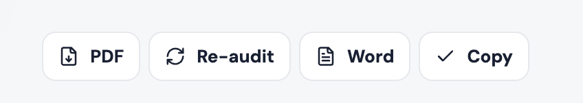
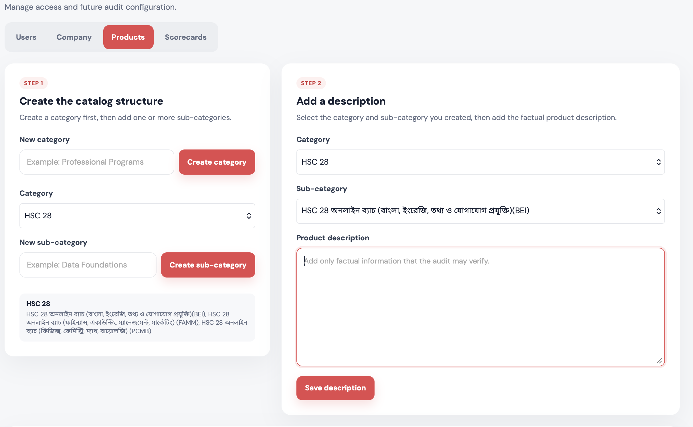

# QA Auditor — User Guide

This guide is for QA agents, QA managers, and administrators. It explains how to use the portal without any technical setup knowledge.

## What the portal does

QA Auditor reviews recorded calls and creates three types of reports:

- **QA audit & scorecard** — scores a call against the selected process scorecard.
- **Customer voice & objections** — summarizes customer needs, questions, and objections.
- **Advisor pitch & coaching** — highlights advisor behavior and coaching actions.

The portal keeps previous reports. Uploading the same recording again shows the saved result. Use **Re-audit** only when you intentionally want a fresh evaluation.

## Signing in

1. Open the portal link provided by your organization.
2. Enter your email and password.
3. If you were given a temporary password, the portal asks you to create a private password before continuing.

Your username is used for display in reports. Use English letters, numbers, spaces, dots, dashes, or underscores.

## The Audit page

The Audit page is where calls are evaluated.

### Start an audit

1. Select **Audit** in the top navigation.
2. Add one or more recordings by dropping them into the upload area or choosing files.
3. Choose an **Analysis mode**.
4. For QA audit or Advisor coaching, choose a **QA parameter**. Customer Voice does not require one.
5. Optionally choose one or more categories and sub-categories. Leaving them empty gives a generic evaluation.
6. Press **Run**.

For multiple recordings, the portal evaluates them one by one. You can see progress and failed filenames while the successful calls continue. The final Audit screen shows the run summary; individual calls remain available under Reports.

### Re-audit a previous call

When a recording already has a saved result, the normal Run action reuses that result. This protects the free AI quota and prevents accidental duplicate evaluations.

To evaluate it again:

1. Open the saved result on the Audit page.
2. Press the red **Re-audit** button at the end of the report actions.
3. Wait for the fresh result.

The previous report is preserved in Reports, and the fresh result is stored as a new record.

## Reports

Reports is a searchable history of evaluated calls. It includes QA, Customer Voice, Advisor Coaching, and generated Summary reports.

The table shows timestamp, mode, agent, process, duration, score, and CE status. Select the eye action to open a report. PDF, Word, and Copy actions are available from the report detail view.

### Filters

Filters are multi-select and searchable where applicable:

- Agent
- Process or parameter
- Report mode
- CE status
- Report owner (administrators and managers)
- Date range
- Minimum and maximum score
- Text search

The default date range is month-to-date. Clear or change the dates when reviewing another period.

### Metrics

The cards below the filters show the current filtered results:

- **Calls evaluated** — number of calls in the result set.
- **Average QA score** — average score, including CE calls as zero.
- **AHT** — average duration for calls with a known duration.
- **CE count** — number of critical-error calls.

## Generating a stored-call Summary

The Reports **Summary** view creates a cross-call summary without uploading or re-analyzing audio.

1. Open **Reports → Summary**.
2. Use the filters to find QA scorecard calls.
3. Tick the calls you want to compare.
4. Press **Generate Summary**.
5. Open, copy, or export the generated Summary report.

Only QA scorecard records can be selected. The generated Summary is saved in normal report history.

## Account menu

Select your profile in the top-right corner. The menu contains:

- **Change Password/API** — change your password or manage your personal Gemini/OpenAI key.
- **Change language** — switch between English and Bangla.
- **Admin panel** — visible only to administrators.
- **Logout**.

API keys are encrypted and are never shown again after saving. Each user manages only their own key.

## Roles and permissions

### User

Users can:

- Run audits with their configured provider key.
- View their own reports.
- Generate summaries from their own QA calls.
- Change their password, language, and API key.

### Manager

Managers have the same audit abilities as users, and can also:

- View all users’ reports for the company.
- Filter reports by owner, agent, process, mode, date, score, and CE.
- Generate summaries from reports they are authorized to view.

Managers cannot manage users, company settings, products, or scorecards.

### Administrator

Administrators can do everything a manager can, plus:

- Create, deactivate, reactivate, and reset users.
- Promote or demote users and managers.
- Change the company name for future reports.
- Add, edit, and archive product categories, sub-categories, and briefs.
- Add, edit, and archive scorecards.

## Admin panel

The Admin panel is available only to administrators.

### Users

Create a user with an email, username, and temporary password. API keys are never entered by an administrator. The new user adds their own key after signing in.

Use the role selector to assign **User**, **Manager**, or **Admin**. Deactivating a user immediately prevents login and new audits.

### Company

Change the company name used in future reports. Existing reports keep the company name that was recorded when they were created.

### Products

Products are created in two stages:

1. Create a category.
2. Select that category and create one or more sub-categories.
3. Select an existing category and sub-category.
4. The existing description appears automatically when one is saved.
5. Add or edit factual product information and save it.

Archived products disappear from new audit selectors but remain in historical report snapshots.

### Scorecards

Create a scorecard by defining its name, categories, weighted rows, and critical-error rules. Each row should have a unique name and a positive maximum. Save the scorecard only after the category totals reconcile to the overall maximum.

Archived scorecards are removed from new selectors but remain available in old reports.

## Understanding common states

- **Cached result** — the saved result was reused; no new AI request was made.
- **Fresh AI result** — the call was evaluated now.
- **Queued** — the server is waiting for an available worker.
- **Processing** — the call is currently being evaluated.
- **Partial** — some calls succeeded and one or more calls failed.
- **Unsaved results warning** — a report was generated, but database storage was temporarily unavailable. Keep or export the report and try again later.
- **CE** — a critical error was detected. The final score is zero.

## Good operating practices

- Use clear filenames so agents can be identified later.
- Select a category/sub-category when product-specific verification matters.
- Keep the correct process scorecard selected.
- Use Re-audit only when a fresh evaluation is needed.
- Review failed-call notices before assuming a whole batch completed.
- Use Reports filters and Summary for coaching reviews instead of uploading the same calls again.
